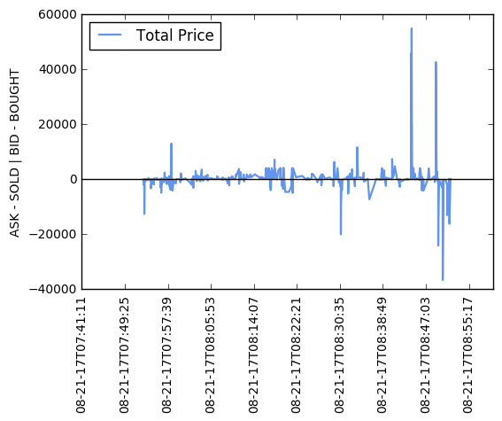

##  Whale Moves Indicator

Custom trading indicator for Bitcoin Whale Moves detection using data from Cryptomon API (https://api.cryptomon.io/swagger-ui.html).

### What is a Bitcoin Whale?

The term “whale” is frequently used to describe the big money Bitcoin players that show their hand in the Bitcoin market.

### API Credentials

To obtain API credentials, follow these instructions:
1. Create new Premium Account: https://cryptomon.io/create-account
2. API credentials under Account information: https://cryptomon.io/account#api


### Run Python code

To run the code below:

1. Click on the cell to select it.
2. Press `SHIFT+ENTER` on your keyboard or press the play button (<button class='fa fa-play icon-play btn btn-xs btn-default'></button>) in the toolbar above.

A full tutorial for using the notebook interface is available [here](ipython_examples/Notebook/Index.ipynb).


```python
%env TZ=UTC

import sys
sys.path.append("../API_Client/")

from ApiClient import ApiClient

import Utils
from Utils import plot_trade_data, start_time, end_time, process_data

print("\n")
print('Whale Moves Indicator\n')
print("\n")
print("      ':'                ")
print("    ___:____     |'\/'|  ")
print("  ,'        `.    \  /   ")
print("  |  O        \___/  |   ")
print("~^~^~^~^~^~^~^~^~^~^~^~^~")
print("\n")

# Cryptomon API credentials
CLIENT_ID = "<API_CLIENT_ID>"
CLIENT_SECRET = "<API_CLIENT_SECRET>"

c = ApiClient(CLIENT_ID, CLIENT_SECRET)
c.request_access()

params = {
    "market" : "BITSTAMP",
    "currencyPair" : "BTC_USD",
    "timestampFrom" : start_time(1),
    "timestampTo" : end_time()
}
rows = c.get("https://api.cryptomon.io/api/v1/trades", params)

plot_trade_data(process_data(rows))

```

    env: TZ=UTC


    Whale Moves Indicator


          ':'                
        ___:____     |'\/'|  
      ,'        `.    \  /   
      |  O        \___/  |   
    ~^~^~^~^~^~^~^~^~^~^~^~^~


    Requesting access_token...
    Success, access_token: 7c0790b5-f593-2d56-bfa5-82106a0e362b, expires_in: 3599
    Request, url: https://api.cryptomon.io/api/v1/trades, params: {'timestampTo': '1503305576000', 'currencyPair': 'BTC_USD', 'market': 'BITSTAMP', 'timestampFrom': '1503301976000'}
    Success, status_code: 200





```python
# Let's convert this notebook to a README for the GitHub project's title page:
!jupyter nbconvert --to markdown main.ipynb
!mv main.md README.md
```

    [NbConvertApp] Converting notebook main.ipynb to markdown
    [NbConvertApp] Writing 1996 bytes to main.md
